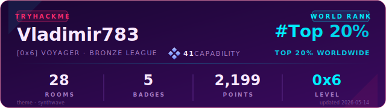

<!--

    

        
        <h4>< Pentester >·< Developer ></h4>
    

-->

  

    
    
    
  

---

### 👁️ About Me

Passionate about cybersecurity and pentesting, with a practical focus on analyzing systems, networks, and applications. 

---

### ❔ Areas of Interest

- ⚔️ Offensive cybersecurity
- 🔎 Network and system analysis
- 📝 Scripting, tooling, and automation
- 🧠 Challenges, puzzles, and CTFs
<!-- - ✨ Anime and games-->

---

<!--
### 🌍 Languages I Speak

  <table>
    <tr>
      <td align="center">
        
        
<strong>English</strong>

      </td>
      <td align="center">
        
        
<strong>Spanish</strong>

      </td>
    </tr>
  </table>

---
-->

<h3>🔌 Technologies</h4>
     
    <!-- ,django,flask,fastapi,mysql
    
    
    
    
    
    
    
    
    
    
    
    
    
    
    
    
    
    -->

<h3>⚙️ Programming and Markup Languages</h4>
    
    <!-- ,nim
    
    
    
    
    
    
    
    
    -->

 

<h4>🛠️ Other Tools</h4>
    
    
    
    
    

<h4>🖥️ OS</h4>
    
    
    
    
    
    
    

 

<h4>💜 I Support</h4>
    
    
 
    
    
    
 
    
    
 
    <!-- 
     -->
    
    
 

<!--  -->

 

---

### 📈 Stats

  

<!--

 

 

-->

  
  

<!--

  

-->

---

### 🏆 Trophies

  

---

### ❕ Find Me On

  <h4>⚔️ Codewars</h4>
  

 
<!--

  <h4>🐍 TryHackMe</h4>
  

-->

---

### 🌐 Contact

<!--

- 📩 E-mail: linuxusercs47@gmail.com
- 🔵 Discord: vladimir783

-->

 

<!--
### Otras plataformas:

- TryHackMe:
- HackTheBox:

**Volodishlav/Volodishlav** is a ✨ _special_ ✨ repository because its `README.md` (this file) appears on your GitHub profile.

Here are some ideas to get you started:

- 🔭 I’m currently working on ...
- 🌱 I’m currently learning ...
- 👯 I’m looking to collaborate on ...
- 🤔 I’m looking for help with ...
- 💬 Ask me about ...
- 📫 How to reach me: ...
- 😄 Pronouns: ...
- ⚡ Fun fact: ...
-->
